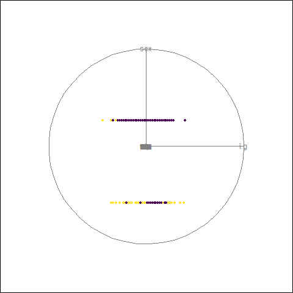

# Task 1 - Exploratory analysis of the data

### [Heart Disease Dataset](https://archive.ics.uci.edu/ml/datasets/heart+disease)

### Team composition:

-   Amihaesei Sergiu
-   Stoica George

## Preliminaries

```{r, results=FALSE, message=FALSE, warning=FALSE, error=FALSE}
library("gifski")
library("knitr")
library("tourr")

data <- read.csv(file = 'D:\\Facultate\\Data-Mining\\heart.csv')
```


## Projection Pursuit

```{r, results=FALSE, message=FALSE, warning=FALSE, error=FALSE}
render_gif(data[, -ncol(data)], grand_tour(d=2), display_xy())
```
```{r}

```

